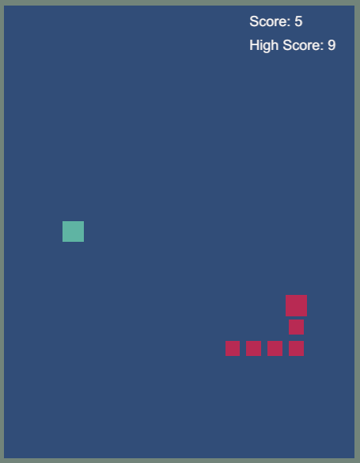

# Snake Game - Unity  - 1

- [for English](#en)
- [Türkçe için](#tr)

## EN <a name="en">

This project features a classic Snake game developed using the Unity game engine. The game focuses on fundamental game development concepts such as Rigidbody, Box Collider, interaction management, and scoring systems.

## Project Overview 

This project was created to develop a simple Snake game. Various mechanics have been added to increase the snake's length and score while the player controls the snake. Additionally, the game includes interaction and collision systems, as well as score management.

## Key Features

- **Snake Control**: The snake can be controlled using the WASD keys. The direction of the snake changes based on these keys.
- **Snake Growth**: The snake grows in length and increases the score when it consumes a segment.
- **Score Management**: The current score and high score of the player are displayed on the screen. The high score represents the highest score recorded in the game.
- **Interaction and Collision**: The game restarts when the snake collides with itself or the surrounding walls.
- **Rigidbody and Box Collider**: The snake and surrounding objects use Rigidbody and Box Collider components to detect collisions and manage movements.

## Concepts Learned

### Rigidbody and Box Collider

- **Rigidbody**: Used to manage physical movement and collisions. Provides control over the snake's movement and collisions.
- **Box Collider**: Used to detect collisions. Manages collisions between the snake and surrounding objects.

### Interaction Management

- **OnTriggerEnter2D**: Detects collisions between the snake and other objects, performing necessary actions such as restarting the game.

### Scoring System

- **Score Management**: Displays the player's current score and high score on the screen. The score updates with each new segment added.
- **PlayerPrefs**: Used to store score data persistently. The player's highest score is saved and used in future games.

## Screenshot

---

## TR <a name="tr">

Bu proje, Unity oyun motorunu kullanarak geliştirilmiş klasik bir Yılan (Snake) oyununu içermektedir. Bu oyunda, temel oyun geliştirme konseptleri olan Rigidbody, Box Collider, etkileşim yönetimi ve skor sistemi üzerinde çalışılmıştır.

### Proje Özeti <a name="tr">

Bu proje, basit bir Yılan oyunu geliştirmek için oluşturulmuştur. Oyuncu yılanı kontrol ederken, yılanın uzunluğunu ve skorunu artırmak için çeşitli mekanikler eklenmiştir. Ayrıca, oyunda etkileşim ve çarpışma sistemleri ile skor yönetimi de sağlanmıştır.

### Temel Özellikler

- **Yılan Kontrolü**: Yılan, WASD tuşları ile kontrol edilebilir. Yılanın yönü bu tuşlara göre değişir.
- **Yılanın Büyümesi**: Yılan bir segmenti yediğinde, yılanın uzunluğu artar ve puanı artırır.
- **Skor Yönetimi**: Oyuncunun mevcut skoru ve yüksek skoru ekranda gösterilir. Yüksek skor, oyunun kaydedilen en yüksek puanıdır.
- **Etkileşim ve Çarpışma**: Yılan kendisiyle veya çevre duvarlarıyla çarpıştığında oyun yeniden başlar.
- **RigidBody ve Box Collider**: Yılan ve çevresindeki nesneler, çarpışmaları tespit etmek ve hareketleri yönetmek için Rigidbody ve Box Collider bileşenlerini kullanır.

### Öğrenilen Konseptler

- **Rigidbody ve Box Collider**: Fiziksel hareket ve çarpışma işlemlerini yönetir ve çarpışmaları tespit eder.
- **Etkileşim Yönetimi**: OnTriggerEnter2D ile çarpışmaları tespit eder ve oyunun yeniden başlatılması gibi eylemleri gerçekleştirir.
- **Skor Sistemi**: Oyuncunun mevcut puanını ve yüksek skorunu ekranda gösterir ve PlayerPrefs kullanılarak verileri kalıcı olarak saklar.

